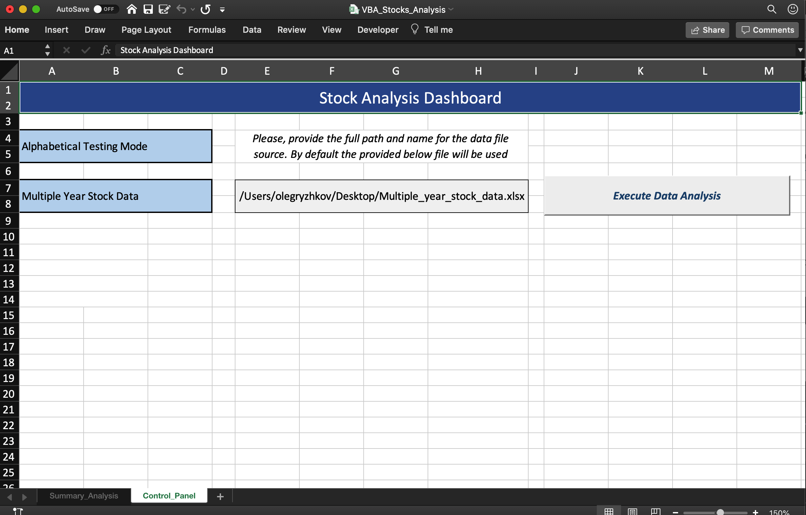
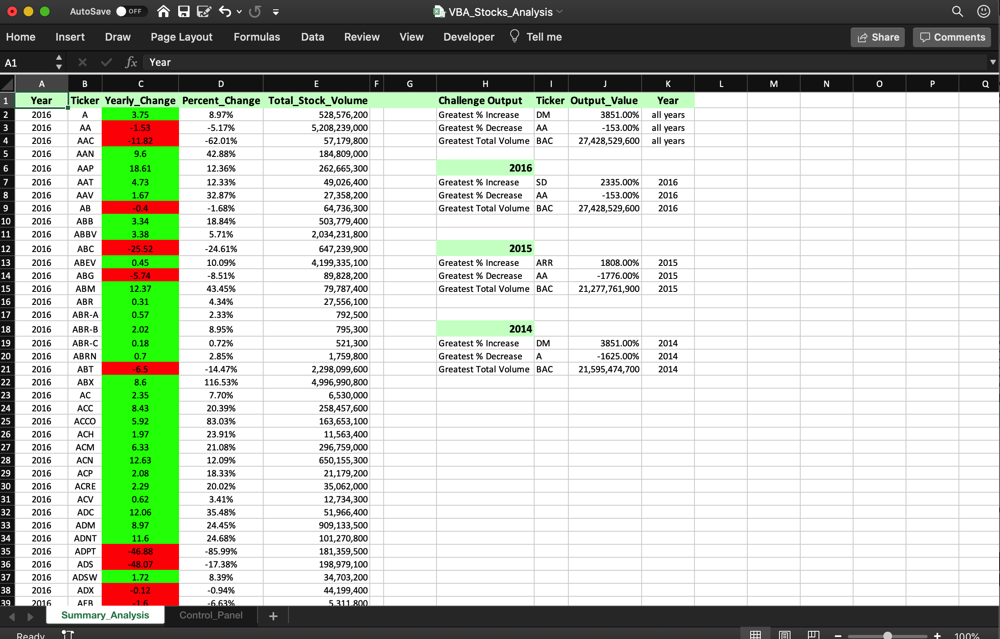

# VBA-challenge

VBA-challenge is a Stock Market Analysis VBA Module for Excel.

[](https://shields.io/)
[](http://commonmark.org)
[](http://hits.dwyl.com/{username}/{project-name})
[](https://github.com/OlegRyzhkov2020/VBA-challenge/StrapDown.js/watchers/)


## Installation

The module uses Microsoft Excel. Get it now with a Microsoft 365 subscription

```bash
https://www.microsoft.com/en-us/microsoft-365/excel
```
Please, provide the full path and name for the data file source. By default the provided file below will be used



## Usage
As a first step, the module imports data from the Source Workbook and loops through all the stocks for each year over all Worksheets  (see VBA script extract sample below)

```python
'Open Source Workbook
Application.ScreenUpdating = False
Application.DisplayAlerts = False

file_Name = Range("E7")
Set wk = Workbooks.Open(file_Name, ReadOnly:=True)

'Iteration Source Workbook over all sheets
For Each sheet In wk.Worksheets

'Getting Last row number for data on active sheet
    sheet.Activate
    last_Row = Cells(Rows.Count, 1).End(xlUp).Row

```
The summary table outputs the following information:
+ The ticker symbol
+Yearly change from opening price at the beginning of a given year to the closing price at the end of that year.
+ The percent change from opening price at the beginning of a given year to the closing price at the end of that year.
+ The total stock volume of the stock.

The solution is able to return the stock with the "Greatest % increase", "Greatest % decrease" and "Greatest total volume" per each year.


## Contacts
[Find Me on
LinkedIn](https://www.linkedin.com/in/oleg-n-ryzhkov/)
